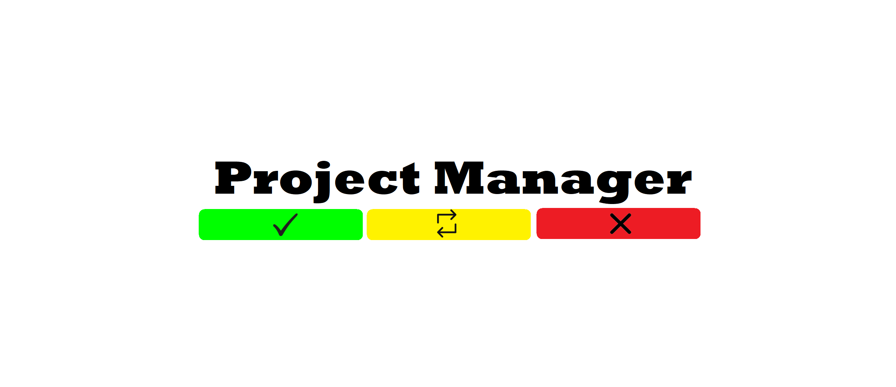
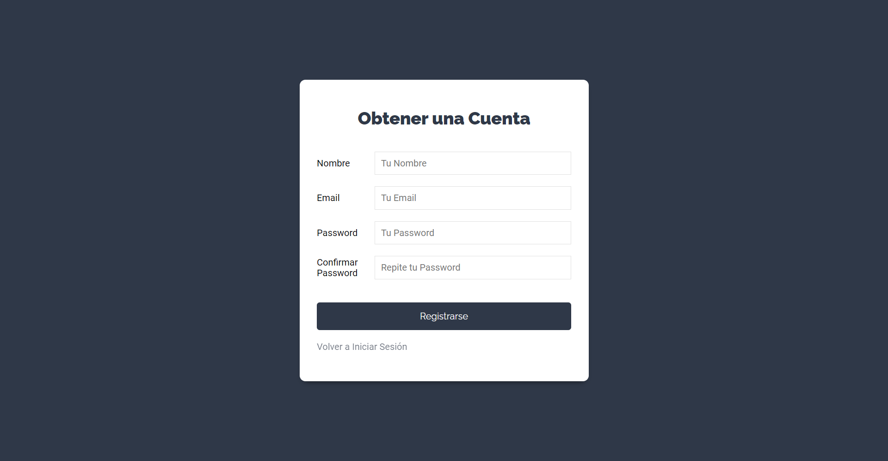
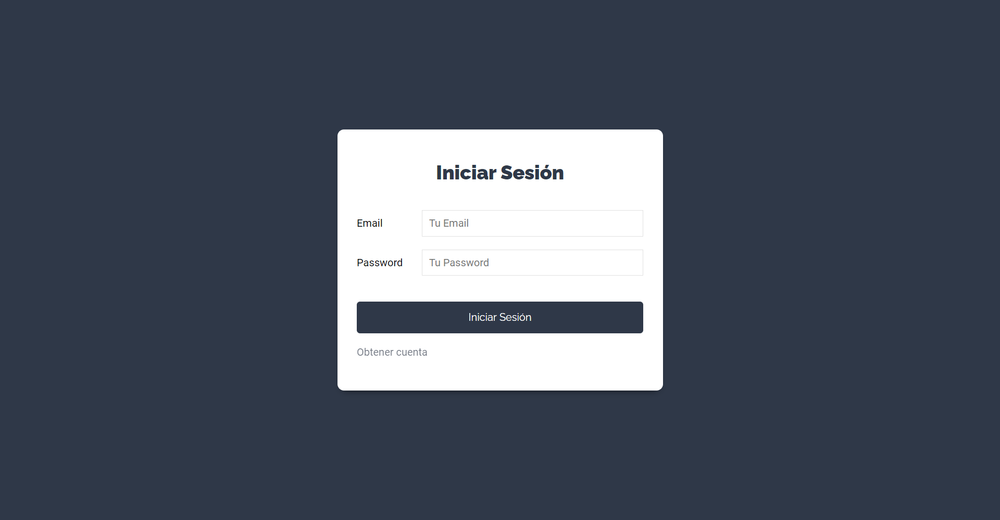
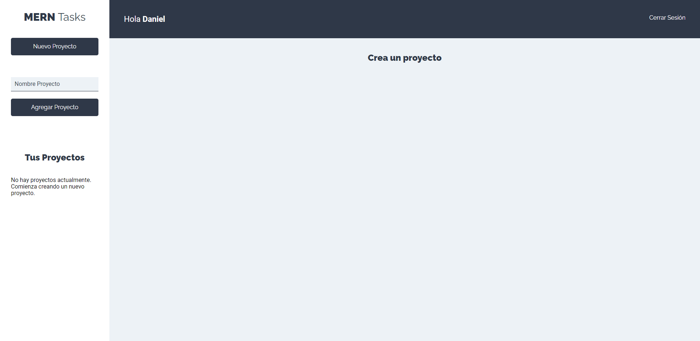
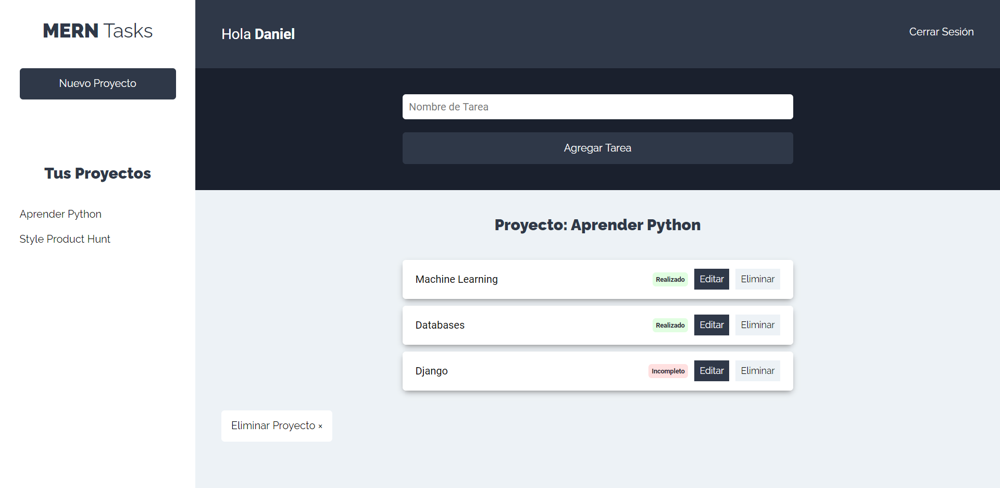

<p align="center">

</p>

# MERN-task-manager
Welcome Project Manager app.

## Built With

### Front-end

* [React](https://reactjs.org/)
* [React Hooks](https://reactjs.org/docs/hooks-intro.html/)

### Back-end

* [Javascript](https://www.javascript.com/)
* [Nodejs](https://nodejs.org/en/)
* [Express](https://expressjs.com/)
* [Bcrypt-nodejs](https://www.npmjs.com/package/bcrypt/)
* [cors](https://www.npmjs.com/package/cors)
* [Jsonwebtoken](https://www.npmjs.com/package/jsonwebtoken)

### Data Bases

* [Mongo DB](https://www.mongodb.com/)

## What is Project Manager?

The easy and visual way to manage your projects and tasks.

* [Project Manager](https://stackmerntasks.netlify.app/)

In this project I have created a full website with features including users register and log-in and projects and tasks creation.

## Getting Started

### Prerequisites

For this project you need:

```
Nodejs
```

```
MongoDB
```

### Installing

Go to MERN-task-manager/server and run:

```
npm install
```

Run the server.

```
nodemon index.js
```
Run MongoDB
```
Mongod
```

Now you can go to MERN-task-manager/client and install all the react dependencies:

```
npm install
```

## Running React

In the folder MERN-task-manager/client run:

```
npm start
```

Now you can see the Project Manager web!


## Result

### Navigation

* Sign In



* Log In



* Home



* Projects and Tasks

